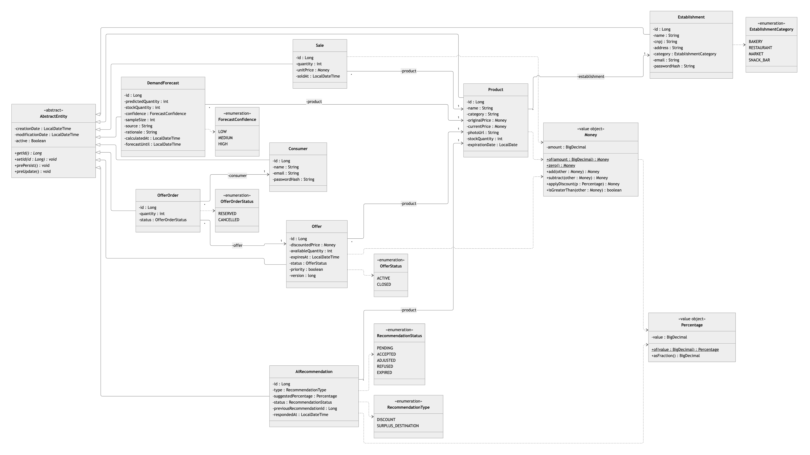
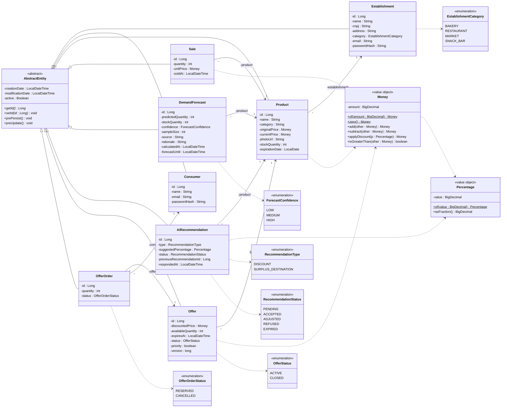
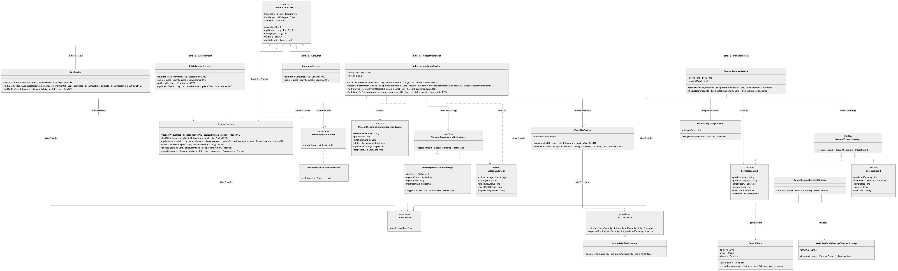
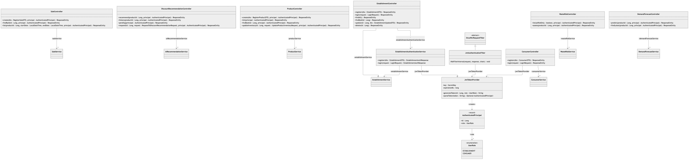

# Diagrama de Classes — FoodRescue API

Diagrama de classes UML do estado atual do projeto: fundação arquitetural (`#1`) e os casos
de uso **UC01 Cadastrar estabelecimento**, **UC02 Cadastrar produtos**, **UC03 Gerenciar
estoque e validade**, **UC04 Registrar venda**, **UC05 Prever demanda**, **UC06 Identificar
risco de desperdício** e **UC07 Recomendar preço dinâmico**.

Para continuar legível, o modelo foi dividido em três vistas, uma por camada:

| Vista | Módulos Maven | Imagem |
|---|---|---|
| 1. Modelo de domínio | `domain`, `core` | `diagrama_classes.png` |
| 2. Camada de negócio | `business`, `core` | `diagrama_classes_negocio.png` |
| 3. Camada REST e segurança | `rest` | `diagrama_classes_rest.png` |

## Notação UML usada

| Elemento | Notação |
|---|---|
| Visibilidade | `+` público · `-` privado · `#` protegido |
| Atributo | `-nome : Tipo` |
| Operação | `+nome(param : Tipo) : Retorno`; *itálico* = abstrata; <u>sublinhado</u> = estática (classificador) |
| Estereótipos | `«abstract»`, `«interface»`, `«enumeration»`, `«record»`, `«value object»` |
| Generalização (herança) | linha cheia com triângulo vazado |
| Realização (implementa interface) | linha tracejada com triângulo vazado |
| Associação navegável | linha cheia com seta aberta; o rótulo é o papel (nome do atributo) e as pontas têm multiplicidade |
| Dependência | linha tracejada com seta aberta (`«create»` = a classe instancia o alvo) |
| Classe template | `GenericService<E, D>`; as subclasses ligam os parâmetros (`«bind» E→Entidade`) |

**Omitido de propósito** (para não poluir): getters/setters, construtores e métodos privados;
DTOs de entrada/saída; builders (`*Builder`); mappers (`*Mapper`/`DTOMapper`); conversores
JPA (`MoneyConverter`, `PercentageConverter`); repositórios (interfaces Spring Data finas
sobre `GenericRepository<E>`); validadores de negócio (`*BusinessValidator`, que estendem
`AbstractValidator<T>` e implementam `BusinessValidator<T>`); `AuditRevisionEntity`
(Envers); e classes de infraestrutura (`RestExceptionHandler`, `SecurityConfig`,
`OpenApiConfig`, handlers 401/403). Nas vistas 2 e 3, classes de outras camadas aparecem só
com o nome.

## 1. Modelo de domínio

## 2. Camada de negócio

```mermaid
classDiagram
    direction TB

    class GenericService~E, D~ {
        <<abstract>>
        #repository : GenericRepository~E~
        #dtoMapper : DTOMapper~E, D~
        #validator : Validator
        +save(dto : D) D
        +update(id : Long, dto : D) D
        +findById(id : Long) D
        +findAll() List~D~
        +deleteById(id : Long) void
    }

    class EstablishmentService {
        +save(dto : EstablishmentDTO) EstablishmentDTO
        +login(request : LoginRequest) EstablishmentDTO
        +getById(id : Long) EstablishmentDTO
        +updateProfile(id : Long, dto : EstablishmentUpdateDTO) EstablishmentDTO
    }

    class ConsumerService {
        +save(dto : ConsumerDTO) ConsumerDTO
        +login(request : LoginRequest) ConsumerDTO
    }

    class ProductService {
        +registerProduct(dto : RegisterProductDTO, establishmentId : Long) ProductDTO
        +findAllForEstablishment(establishmentId : Long) List~ProductDTO~
        +updateInventory(id : Long, establishmentId : Long, request : UpdateProductInventoryRequest) ProductInventoryUpdateDTO
        +findProductOwnedBy(id : Long, establishmentId : Long) Product
        +deductStock(id : Long, establishmentId : Long, quantity : int) Product
        +applyDiscount(id : Long, establishmentId : Long, percentage : Percentage) Product
    }

    class SaleService {
        +registerSale(dto : RegisterSaleDTO, establishmentId : Long) SaleDTO
        +findSalesByProductAndPeriod(productId : Long, establishmentId : Long, startDate : LocalDateTime, endDate : LocalDateTime) List~SaleDTO~
        +findByIdForEstablishment(id : Long, establishmentId : Long) SaleDTO
    }

    class DemandForecastService {
        -closingTime : LocalTime
        -lookbackWeeks : int
        +predictDemand(productId : Long, establishmentId : Long) DemandForecastResponse
        +findLatest(productId : Long, establishmentId : Long) DemandForecastResponse
    }

    class WasteRiskService {
        -threshold : Percentage
        +assess(productId : Long, establishmentId : Long) WasteRiskDTO
        +findAllForEstablishment(establishmentId : Long, atRiskOnly : boolean) List~WasteRiskDTO~
    }

    class AiRecommendationService {
        -closingTime : LocalTime
        -ttlHours : long
        +recommendDiscount(productId : Long, establishmentId : Long) DiscountRecommendationDTO
        +respondToRecommendation(id : Long, establishmentId : Long, request : RespondToDiscountRecommendationRequest) DiscountRecommendationDTO
        +findPendingForEstablishment(establishmentId : Long) List~DiscountRecommendationDTO~
        +findHistoryForProduct(productId : Long, establishmentId : Long) List~DiscountRecommendationDTO~
    }

    class DemandForecastStrategy {
        <<interface>>
        +forecast(context : ForecastContext) ForecastResult
    }
    class WeekdayHourlyAverageForecastStrategy {
        +SOURCE : String$
        +forecast(context : ForecastContext) ForecastResult
    }
    class GeminiDemandForecastStrategy {
        +forecast(context : ForecastContext) ForecastResult
    }
    class ForecastEligibilityChecker {
        -minimumSales : int
        +isEligible(salesHistory : List~Sale~) boolean
    }
    class ForecastContext {
        <<record>>
        +productName : String
        +productCategory : String
        +salesHistory : List~Sale~
        +currentStock : int
        +now : LocalDateTime
        +closingAt : LocalDateTime
    }
    class ForecastResult {
        <<record>>
        +predictedQuantity : int
        +confidence : ForecastConfidence
        +sampleSize : int
        +source : String
        +rationale : String
    }

    class GeminiClient {
        -apiKey : String
        -model : String
        -timeout : Duration
        +isConfigured() boolean
        +generateJson(prompt : String, responseSchema : Map) JsonNode
    }

    class RiskCalculator {
        <<interface>>
        +calculate(stockQuantity : int, predictedQuantity : int) Percentage
        +expectedSurplus(stockQuantity : int, predictedQuantity : int) int
    }
    class SurplusRatioRiskCalculator {
        +calculate(stockQuantity : int, predictedQuantity : int) Percentage
    }

    class DiscountRecommendationStrategy {
        <<interface>>
        +suggest(context : DiscountContext) Percentage
    }
    class RiskWeightedDiscountStrategy {
        -riskFactor : BigDecimal
        -urgencyBonus : BigDecimal
        -urgentHours : long
        -maxDiscount : BigDecimal
        +suggest(context : DiscountContext) Percentage
    }
    class DiscountContext {
        <<record>>
        +riskPercentage : Percentage
        +stockQuantity : int
        +expectedSurplus : int
        +hoursUntilClosing : long
        +daysUntilExpiration : Long
    }

    class DomainEventPublisher {
        <<interface>>
        +publish(event : Object) void
    }
    class InProcessDomainEventPublisher {
        +publish(event : Object) void
    }
    class DiscountRecommendationRespondedEvent {
        <<record>>
        +recommendationId : Long
        +productId : Long
        +establishmentId : Long
        +status : RecommendationStatus
        +appliedPercentage : BigDecimal
        +respondedAt : LocalDateTime
    }

    class TimeProvider {
        <<interface>>
        +now() LocalDateTime
    }

    GenericService <|-- EstablishmentService : «bind» E→Establishment
    GenericService <|-- ConsumerService : «bind» E→Consumer
    GenericService <|-- ProductService : «bind» E→Product
    GenericService <|-- SaleService : «bind» E→Sale
    GenericService <|-- DemandForecastService : «bind» E→DemandForecast
    GenericService <|-- AiRecommendationService : «bind» E→AiRecommendation

    SaleService --> "1" ProductService : -productService
    AiRecommendationService --> "1" ProductService : -productService
    AiRecommendationService --> "1" WasteRiskService : -wasteRiskService
    AiRecommendationService --> "1" DiscountRecommendationStrategy : -discountStrategy
    AiRecommendationService --> "1" DomainEventPublisher : -eventPublisher
    AiRecommendationService ..> DiscountRecommendationRespondedEvent : «create»
    AiRecommendationService ..> DiscountContext : «create»
    WasteRiskService --> "1" RiskCalculator : -riskCalculator
    DemandForecastService --> "1" DemandForecastStrategy : -forecastStrategy
    DemandForecastService --> "1" ForecastEligibilityChecker : -eligibilityChecker
    DemandForecastService ..> ForecastContext : «create»

    DemandForecastStrategy <|.. WeekdayHourlyAverageForecastStrategy
    DemandForecastStrategy <|.. GeminiDemandForecastStrategy
    GeminiDemandForecastStrategy --> "1" WeekdayHourlyAverageForecastStrategy : -fallback
    GeminiDemandForecastStrategy --> "1" GeminiClient : -geminiClient
    DemandForecastStrategy ..> ForecastContext
    DemandForecastStrategy ..> ForecastResult

    RiskCalculator <|.. SurplusRatioRiskCalculator
    DiscountRecommendationStrategy <|.. RiskWeightedDiscountStrategy
    DiscountRecommendationStrategy ..> DiscountContext
    DomainEventPublisher <|.. InProcessDomainEventPublisher

    ProductService --> "1" TimeProvider : -timeProvider
    SaleService --> "1" TimeProvider : -timeProvider
    DemandForecastService --> "1" TimeProvider : -timeProvider
    AiRecommendationService --> "1" TimeProvider : -timeProvider
```

## 3. Camada REST e segurança

```mermaid
classDiagram
    direction TB

    class EstablishmentController {
        +register(dto : EstablishmentDTO) ResponseEntity
        +login(request : LoginRequest) ResponseEntity
        +findAll() ResponseEntity
        +findById(id : Long) ResponseEntity
        +update(id : Long, dto : EstablishmentUpdateDTO) ResponseEntity
        +delete(id : Long) ResponseEntity
    }
    class ConsumerController {
        +register(dto : ConsumerDTO) ResponseEntity
        +login(request : LoginRequest) ResponseEntity
    }
    class ProductController {
        +create(dto : RegisterProductDTO, principal : AuthenticatedPrincipal) ResponseEntity
        +list(principal : AuthenticatedPrincipal) ResponseEntity
        +findById(id : Long, principal : AuthenticatedPrincipal) ResponseEntity
        +updateInventory(id : Long, request : UpdateProductInventoryRequest, principal : AuthenticatedPrincipal) ResponseEntity
    }
    class SaleController {
        +create(dto : RegisterSaleDTO, principal : AuthenticatedPrincipal) ResponseEntity
        +findById(id : Long, principal : AuthenticatedPrincipal) ResponseEntity
        +list(productId : Long, startDate : LocalDateTime, endDate : LocalDateTime, principal : AuthenticatedPrincipal) ResponseEntity
    }
    class DemandForecastController {
        +predict(productId : Long, principal : AuthenticatedPrincipal) ResponseEntity
        +findLatest(productId : Long, principal : AuthenticatedPrincipal) ResponseEntity
    }
    class WasteRiskController {
        +list(atRiskOnly : boolean, principal : AuthenticatedPrincipal) ResponseEntity
        +assess(productId : Long, principal : AuthenticatedPrincipal) ResponseEntity
    }
    class DiscountRecommendationController {
        +recommend(productId : Long, principal : AuthenticatedPrincipal) ResponseEntity
        +history(productId : Long, principal : AuthenticatedPrincipal) ResponseEntity
        +pending(principal : AuthenticatedPrincipal) ResponseEntity
        +respond(id : Long, request : RespondToDiscountRecommendationRequest, principal : AuthenticatedPrincipal) ResponseEntity
    }

    class EstablishmentAuthenticationService {
        +register(dto : EstablishmentDTO) EstablishmentAuthResponse
        +login(request : LoginRequest) EstablishmentAuthResponse
    }
    class JwtTokenProvider {
        -key : SecretKey
        -expirationMs : long
        +generateToken(id : Long, role : UserRole) String
        +parseToken(token : String) Optional~AuthenticatedPrincipal~
    }
    class JwtAuthenticationFilter {
        #doFilterInternal(request, response, chain) void
    }
    class OncePerRequestFilter {
        <<abstract>>
    }
    class AuthenticatedPrincipal {
        <<record>>
        +id : Long
        +role : UserRole
    }
    class UserRole {
        <<enumeration>>
        ESTABLISHMENT
        CONSUMER
    }

    class EstablishmentService
    class ConsumerService
    class ProductService
    class SaleService
    class DemandForecastService
    class WasteRiskService
    class AiRecommendationService

    EstablishmentController --> "1" EstablishmentService : -establishmentService
    EstablishmentController --> "1" EstablishmentAuthenticationService : -establishmentAuthenticationService
    EstablishmentAuthenticationService --> "1" EstablishmentService : -establishmentService
    EstablishmentAuthenticationService --> "1" JwtTokenProvider : -jwtTokenProvider
    ConsumerController --> "1" ConsumerService : -consumerService
    ConsumerController --> "1" JwtTokenProvider : -jwtTokenProvider
    ProductController --> "1" ProductService : -productService
    SaleController --> "1" SaleService : -saleService
    DemandForecastController --> "1" DemandForecastService : -demandForecastService
    WasteRiskController --> "1" WasteRiskService : -wasteRiskService
    DiscountRecommendationController --> "1" AiRecommendationService : -aiRecommendationService

    OncePerRequestFilter <|-- JwtAuthenticationFilter
    JwtAuthenticationFilter --> "1" JwtTokenProvider : -jwtTokenProvider
    JwtTokenProvider ..> AuthenticatedPrincipal : «create»
    AuthenticatedPrincipal --> "1" UserRole : +role
```

## Como ler

- **Navegabilidade das associações**: as setas apontam de quem guarda a referência para
  quem é referenciado. `Product` tem o atributo `establishment` (`products.establishment_id`),
  então a seta vai de `Product` para `Establishment` com multiplicidade `* → 1`; o
  `Establishment` não tem uma coleção de produtos. O mesmo vale para `Sale`,
  `DemandForecast`, `AiRecommendation` e `Offer` (→ `Product`) e para `OfferOrder`
  (→ `Offer` e → `Consumer`).
- **Enumerações e value objects**: aparecem como tipos de atributo (`-category :
  EstablishmentCategory`, `-currentPrice : Money`) e ligados por dependência, pois são
  embutidos na própria tabela da entidade (`@Enumerated` / `@Convert`), sem identidade
  própria.
- **`Offer` e `OfferOrder`** já existem no domínio (tabelas e entidades), mas ainda não têm
  serviço nem controller — por isso só aparecem na vista 1.
- **Padrão Strategy** (vista 2): três pontos de variação, cada um atrás de uma interface:
  - `DemandForecastStrategy` (UC05): `WeekdayHourlyAverageForecastStrategy` (média por dia
    da semana/hora) e `GeminiDemandForecastStrategy`, que consulta o Gemini e usa a primeira
    como `fallback`;
  - `RiskCalculator` (UC06): `SurplusRatioRiskCalculator` (excedente previsto / estoque);
  - `DiscountRecommendationStrategy` (UC07): `RiskWeightedDiscountStrategy`.
  Os *records* `ForecastContext`, `ForecastResult` e `DiscountContext` são os objetos de
  entrada/saída das estratégias, criados pelos serviços (`«create»`).
- **Encadeamento dos casos de uso**: `AiRecommendationService` (UC07) usa
  `WasteRiskService` (UC06), que lê a última `DemandForecast` gerada pelo
  `DemandForecastService` (UC05) a partir das vendas registradas pelo `SaleService` (UC04).
  Tanto UC04 quanto UC07 alteram o produto via `ProductService` (`deductStock`,
  `applyDiscount`).
- **Eventos de domínio**: ao responder uma recomendação, `AiRecommendationService` cria um
  `DiscountRecommendationRespondedEvent` e o publica pela interface `DomainEventPublisher`,
  implementada por `InProcessDomainEventPublisher` (eventos do Spring, em processo).
- **`TimeProvider`**: interface de relógio (`core`) injetada nos serviços que dependem de
  "agora", para tornar as regras de tempo testáveis.
- **`JwtTokenProvider`** (vista 3) é usado de dois jeitos: o `ConsumerController` o chama
  direto, enquanto o `EstablishmentController` passa por `EstablishmentAuthenticationService`
  (criado porque `business` não pode depender de uma classe da camada REST). Os demais
  controllers recebem a identidade pronta como `AuthenticatedPrincipal`, criado pelo
  `JwtAuthenticationFilter` a cada requisição.
