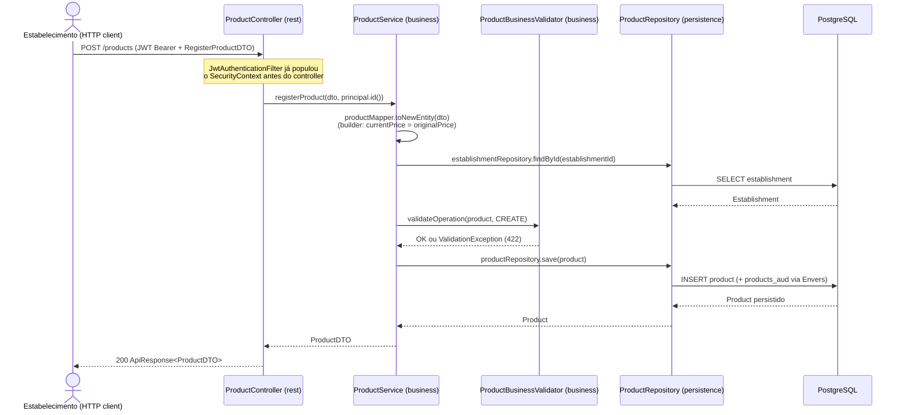
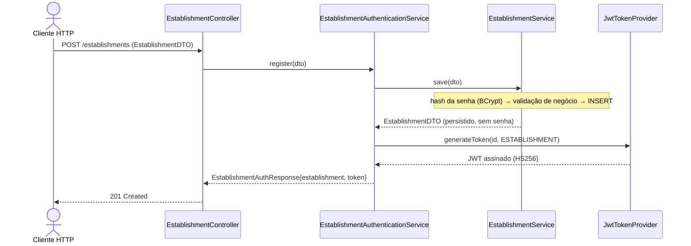

# FoodRescue API — Documentação Técnica

> Documentação gerada a partir das issues do GitHub já concluídas (`#1`–`#4`), dos Pull
> Requests que as implementaram (`#15`–`#18`) e da leitura do código-fonte correspondente.
> Reflete o estado do projeto em **2026-09-15** (branch `develop`, commit `bbfcae3`).

## Visão Geral

**FoodRescue API** é o backend de uma plataforma que conecta **estabelecimentos**
(padarias, restaurantes, mercados, lanchonetes) a **consumidores**, com o objetivo de
reduzir o desperdício de alimentos: estabelecimentos cadastram produtos, controlam
estoque/validade e (em casos de uso futuros, ainda não implementados) criam ofertas com
desconto para produtos perto do vencimento, que consumidores podem visualizar e reservar.

Apenas a fundação arquitetural e os três primeiros casos de uso (cadastro de
estabelecimento, cadastro de produto, gestão de estoque/validade) estão implementados até
o momento. UC04 em diante (vendas, ofertas, recomendações de IA, pedidos de consumidor
etc.) existem apenas como esqueleto de entidades/builders, sem casos de uso, serviços ou
endpoints — **não fazem parte desta documentação** por não corresponderem a nenhuma issue
fechada.

### Stack técnica

| Camada | Tecnologia |
|---|---|
| Linguagem / runtime | Java 21 |
| Framework | Spring Boot 4.1.1 (Spring MVC, Spring Data JPA, Spring Security, Bean Validation) |
| Banco de dados | PostgreSQL 16 |
| Migrations | Liquibase |
| Auditoria | Hibernate Envers |
| Autenticação | JWT (HS256, biblioteca `jjwt`) |
| Documentação de API | springdoc-openapi / Swagger UI |
| Build | Maven multi-módulo |
| Testes | JUnit 5, Mockito, AssertJ |
| Empacotamento | Docker + `docker-compose` (API + Postgres) |

### Arquitetura geral

O projeto segue uma **arquitetura em camadas / hexagonal**, estabelecida pela issue
`#1` e documentada em `ARCHITECTURE.md`, organizada como módulos Maven independentes com
uma direção de dependência estrita:

```
rest → business → persistence → domain → core
```

Nenhum módulo depende de um módulo "acima" dele nessa cadeia — em particular, `business`
nunca importa uma classe concreta de `persistence` (apenas as interfaces de repositório
definidas em `domain`), e `business` nunca depende de um DTO de `rest`.

| Módulo | Pacote raiz | Responsabilidade |
|---|---|---|
| `core` | `br.com.seudominio.foodrescue.core` | Blocos de baixo nível sem conhecimento de domínio: value objects (`Money`, `Percentage`), `TimeProvider`, `MessageUtils` (i18n), framework de validação (`Validator`, `AbstractValidator`, `BusinessOperation`, `ValidationError`, `ValidationException`). |
| `domain` | `br.com.seudominio.foodrescue.domain` | Entidades JPA, builders, enums, DTOs, mappers entidade↔DTO, conversores JPA para os value objects de `core`, hierarquia de exceções de domínio. |
| `persistence` | `br.com.seudominio.foodrescue.persistence` | `GenericRepository<T>` + um repositório Spring Data concreto por agregado. |
| `business` | `br.com.seudominio.foodrescue.business` | `GenericService<E,D>` + um serviço concreto por agregado, validadores de negócio, códigos de erro (`MessageCode`), beans compartilhados (`PasswordEncoder`). |
| `rest` | `br.com.seudominio.foodrescue.rest` | Controllers, envelope de resposta (`ApiResponse`/`ApiError`/`ApiSubError`), segurança JWT, tratamento global de exceções, configuração do Swagger. |

### Fluxo principal (exemplo: cadastro de produto)



Toda exceção lançada em qualquer ponto desse fluxo (validação, entidade não encontrada,
regra de negócio) é capturada de forma centralizada por `RestExceptionHandler`
(`@RestControllerAdvice`), nunca por um `try/catch` dentro do controller — ver
[Como as Partes se Conectam](#como-as-partes-se-conectam).

---

## Funcionalidades Implementadas

### [#1] Fundação arquitetural: camadas, portas e convenções SOLID

- **Objetivo**: estabelecer, antes da implementação de qualquer caso de uso, a estrutura
  de pacotes, as interfaces (portas) e as convenções de código (SOLID) que UC01–UC12
  reutilizariam — entidades ricas, hierarquia de exceções de domínio desacoplada de HTTP,
  autenticação JWT com dois perfis (`Establishment`/`Consumer`), e um tratamento de erro
  único e central.

- **Como funciona**:
  1. **Entidades e value objects.** Toda entidade JPA estende `AbstractEntity`
     (`domain/entities/AbstractEntity.java`), que fornece `creationDate`/`modificationDate`
     (preenchidos via `@PrePersist`/`@PreUpdate`), a flag de soft-delete `active` (default
     `true`) e `equals`/`hashCode` baseados em `getId()`. Cada entidade concreta declara seu
     próprio `@Id`/`@SequenceGenerator` (a sequência muda por entidade) e é anotada com
     `@Audited` do Hibernate Envers — cada INSERT/UPDATE/DELETE gera uma linha na tabela
     `<tabela>_aud`, ligada a `revinfo` (`persistence/.../0002-create-revinfo-table.xml`,
     `0010-create-envers-audit-tables.xml`). As entidades são JavaBeans "anêmicos"
     deliberadamente — **não** validam suas próprias invariantes; isso é responsabilidade de
     um `BusinessValidator` dedicado (decisão explícita registrada em `ARCHITECTURE.md`, uma
     mudança em relação a rascunhos anteriores do projeto).
  2. **Builders** (`domain/builders`) são montadores fluentes sem validação, usados quando
     uma entidade tem múltiplos campos obrigatórios/opcionais e um default de criação (ex.:
     `ProductBuilder` define `currentPrice = originalPrice` quando não informado
     explicitamente). Entidades simples (`Sale`, `OfferOrder`) dispensam builder.
  3. **Value objects `Money`/`Percentage`** (`core/money`, `core/percentage`) encapsulam
     BigDecimal + regras (`Money` nunca é negativo, `Percentage` está sempre entre 0 e 100),
     evitando duplicar essas checagens em cada caso de uso. São persistidos via
     `AttributeConverter` dedicado (`MoneyConverter`, `PercentageConverter`), então a
     coluna do banco continua sendo um `NUMERIC` simples e o resto do código nunca manipula
     `BigDecimal` cru para dinheiro/desconto.
  4. **`TimeProvider`** (`core/time`) abstrai `LocalDateTime.now()` atrás de uma interface
     injetável (`SystemTimeProvider` é a implementação de produção), permitindo testar
     deterministicamente regras de tempo (ex.: "validade no passado" em UC03) sem mockar
     `LocalDateTime` estático.
  5. **Framework de validação de negócio** (`core.validation` + `business.validation`):
     `Validator<T>` define `validate(T)`; `AbstractValidator<T>` acumula erros
     (`ValidationError(message, field, invalidValue, code)`) via `addError(...)` e lança
     `ValidationException` (carrega a lista completa de erros, não apenas o primeiro) quando
     `doValidate` encontrou alguma falha. `BusinessValidator<T>` (em `business`) estende esse
     contrato com `validateOperation(entity, BusinessOperation)`, permitindo regras
     diferentes para `CREATE` vs `UPDATE`. Cada agregado tem um único validador concreto (ex.:
     `EstablishmentBusinessValidator`, `ProductBusinessValidator`) que primeiro roda o bean
     validator (`jakarta.validation.Validator`) sobre a entidade, convertendo cada
     `ConstraintViolation` num `ValidationError`, e depois roda as regras cross-entity
     (unicidade, formato) que exigem acesso a repositório.
  6. **Hierarquia de exceções de domínio** (`domain.exception`), todas *unchecked*
     (`extends RuntimeException`) e nunca cientes de HTTP:
     - `DomainException` — classe abstrata base, nunca lançada diretamente.
     - `EntityNotFoundException` — `new EntityNotFoundException(Product.class, id)` gera a
       mensagem `"Product not found: <id>"`.
     - `BusinessRuleViolationException` — violação de invariante/regra de negócio.
     - `DuplicateEntityException` — violação de unicidade (CNPJ/email duplicado).
  7. **Tratamento de erro centralizado**: `RestExceptionHandler`
     (`rest.exception`, `@RestControllerAdvice`) mapeia cada tipo de exceção para o status
     HTTP correspondente e para o mesmo formato de corpo JSON — ver
     [Como as Partes se Conectam](#como-as-partes-se-conectam) para o detalhe completo do
     mapeamento. Nenhum controller faz `try/catch` manual.
  8. **Autenticação JWT com dois perfis** (`rest.security`): `JwtTokenProvider` emite e
     valida tokens HS256 carregando `id` (subject) e `role` (`ESTABLISHMENT`/`CONSUMER`,
     claim); `JwtAuthenticationFilter` (`OncePerRequestFilter`) lê o header
     `Authorization: Bearer <token>` e popula o `SecurityContext` com um
     `AuthenticatedPrincipal(id, role)` e a authority `ROLE_<role>`; `SecurityConfig`
     libera (`permitAll()`) apenas registro/login de `Consumer`/`Establishment`, a listagem
     pública de estabelecimentos (`GET /establishments`, `GET /establishments/{id}`) e as
     rotas do Swagger — todo o resto exige um token válido, com checagem fina de papel via
     `@PreAuthorize` em cada controller (`@EnableMethodSecurity` ligado). Ver a seção
     dedicada [Autenticação e Autorização](#autenticação-e-autorização) para o fluxo
     completo — emissão do token, validação a cada request, as três camadas de autorização
     e a diferença entre `401`/`403`/`404`.
  9. **CI e fluxo de branches** (`.github/workflows`, `CONTRIBUTING.md`): `develop` é a
     branch de integração (alvo de todo PR de UC), `main` só recebe merge vindo de
     `develop` (workflow `Guard main branch`); todo push/PR roda `mvn verify` como status
     check obrigatório.

- **Arquivos envolvidos** (principais; PR #15 tocou ~100 arquivos, incluindo o esqueleto
  de entidades de casos de uso futuros como `Sale`, `Offer`, `OfferOrder`,
  `AiRecommendation` — não detalhados aqui por não terem caso de uso associado ainda):
  - `core/money/Money.java`, `core/percentage/Percentage.java` — value objects.
  - `core/time/TimeProvider.java`, `SystemTimeProvider.java` — abstração de tempo.
  - `core/validation/*` — framework de validação (`Validator`, `AbstractValidator`,
    `BusinessOperation`, `ValidationError`, `ValidationException`).
  - `domain/entities/AbstractEntity.java` — base de toda entidade.
  - `domain/exception/*` — `DomainException`, `EntityNotFoundException`,
    `BusinessRuleViolationException`, `DuplicateEntityException`.
  - `domain/converter/MoneyConverter.java`, `PercentageConverter.java` — persistência dos
    value objects.
  - `domain/mappers/DTOMapper.java` — contrato `toEntity`/`toDto` de todo mapper.
  - `persistence/repositories/GenericRepository.java` — CRUD genérico com soft-delete.
  - `business/services/GenericService.java` — CRUD genérico de serviço.
  - `business/validation/BusinessValidator.java` — contrato de validador de negócio.
  - `business/helpers/MessageCode.java` — códigos de erro estáveis expostos na API.
  - `business/config/PasswordEncoderConfig.java` — bean `BCryptPasswordEncoder` único,
    compartilhado por `Establishment` e `Consumer`.
  - `rest/exception/RestExceptionHandler.java` — tratamento global de exceções.
  - `rest/dtos/ApiResponse.java`, `ApiError.java`, `ApiSubError.java` — envelope de resposta.
  - `rest/security/*` — `JwtTokenProvider`, `JwtAuthenticationFilter`,
    `AuthenticatedPrincipal`, `SecurityConfig`, `RestAuthenticationEntryPoint`,
    `RestAccessDeniedHandler`.
  - `rest/controller/ConsumerController.java` — cadastro/login mínimo de `Consumer`
    (não é uma UC própria; existe porque UC09 exigirá consumidor autenticado como
    pré-condição).
  - `persistence/resources/db/changelog/**` — migrations Liquibase de todas as tabelas
    base + tabelas de auditoria Envers.

- **Trechos de código relevantes**:

  `GenericRepository` reescreve os métodos padrão do `JpaRepository` para respeitar o
  soft-delete, sem exigir que cada repositório concreto reimplemente a lógica:

  ```java
  @Override
  default void deleteById(@NonNull Long id) {
      Optional<T> entity = findById(id);
      if (entity.isPresent()) {
          entity.get().setActive(false);
          save(entity.get());
      }
  }
  ```

  `AbstractValidator.validate` acumula todos os erros antes de lançar, em vez de falhar no
  primeiro problema encontrado — importante para a UX da API (um único request devolve
  todos os campos inválidos de uma vez):

  ```java
  @Override
  public void validate(T entity) {
      errors.clear();
      doValidate(entity);
      if (!errors.isEmpty()) {
          throw new ValidationException("Validation failed: " + getMessagesErrors(), errors);
      }
  }
  ```

- **Dependências/integrações**: Spring Boot Starter (Web, Data JPA, Security, Validation),
  `jjwt` (emissão/validação de JWT), Hibernate Envers (auditoria), Liquibase (migrations),
  springdoc-openapi (Swagger), PostgreSQL driver.

- **Pontos de atenção**:
  - `RestAuthenticationEntryPoint`/`RestAccessDeniedHandler` constroem seu **próprio**
    `ObjectMapper` (com `JavaTimeModule`) em vez de injetar um bean, porque rodam no nível
    do filtro de segurança, antes do Spring MVC — isso é documentado no `ARCHITECTURE.md`
    como uma decisão deliberada, não um descuido, mas é fácil esquecer ao alterar o formato
    de datas globalmente (um ajuste no `ObjectMapper` do Spring MVC não afeta esses dois
    handlers).
  - A configuração de CORS em `SecurityConfig.corsConfigurationSource()` é
    propositalmente permissiva (`allowedOriginPatterns = "*"`) — o próprio comentário no
    código marca isso como algo a ser restringido quando existir um frontend real.
  - `GenericService.update(id, dto)` lança `IllegalArgumentException` (não uma exceção de
    domínio) quando a entidade não existe; `RestExceptionHandler` mapeia isso para
    `400 Bad Request` — uma inconsistência semântica frente ao restante da API, que usa
    `EntityNotFoundException` → `404` (usado por `EstablishmentService`/`ProductService`
    diretamente, contornando esse caminho do `GenericService`).

- **Referências**: issue [#1](../../issues/1), PR [#15](../../pull/15) (branch
  `feat/config-system`, merge `4bb7c8502`).

---

### [#2] Cadastrar estabelecimento (UC01)

- **Objetivo**: permitir que um novo estabelecimento se registre na plataforma
  informando nome, CNPJ, endereço, categoria e credenciais de acesso, com CNPJ e email
  únicos, sendo autenticado imediatamente após o cadastro.

- **Como funciona**:
  1. `POST /establishments` recebe um `EstablishmentDTO` (`@Valid`), cujo campo
     `password` carrega a senha em texto puro **apenas na entrada** — o mapper nunca o
     popula na saída (`toDto` sempre devolve `password = null`), evitando vazar o hash.
  2. `EstablishmentController.register` delega a
     `EstablishmentAuthenticationService.register`, que primeiro chama
     `EstablishmentService.save(dto)` e depois emite o JWT — essa orquestração
     (`business` + emissão de token) fica em `rest.security`, não em `business`, porque
     `business` não pode depender de `JwtTokenProvider` (uma preocupação de camada REST).
  3. `EstablishmentService.save` converte o DTO em entidade, faz o hash da senha com
     `BCryptPasswordEncoder` **antes** de validar (assim o validador nunca vê a senha em
     texto puro), e chama `EstablishmentBusinessValidator.validateOperation(entity, CREATE)`.
  4. O validador roda, nessa ordem: (a) o bean validator (`@NotBlank`, `@Email` etc. dos
     campos da entidade), (b) formato de CNPJ, (c) unicidade de CNPJ, (d) unicidade de
     email — acumulando todos os erros encontrados antes de lançar `ValidationException`.
  5. **Validação de CNPJ**: implementação completa do algoritmo módulo 11 (dois dígitos
     verificadores, pesos `{5,4,3,2,9,8,7,6,5,4,3,2}` para o primeiro e
     `{6,5,4,3,2,9,8,7,6,5,4,3,2}` para o segundo), rejeitando também sequências de dígito
     repetido (`00000000000000` etc., que passariam no módulo 11 mas não são CNPJs
     válidos). O CNPJ é normalizado (máscara removida via regex `\D`) em
     `EstablishmentMapper.toEntity`/`applyUpdate` **antes** de chegar ao validador — CNPJ
     com ou sem máscara é sempre persistido e comparado da mesma forma.
  6. Unicidade (`validateCnpjUnique`/`validateEmailUnique`) usa
     `Objects.equals(existing.getId(), establishment.getId())` para excluir a própria
     entidade da checagem — necessário em `UPDATE` (o próprio registro não deve "colidir"
     consigo mesmo) e seguro em `CREATE`, onde `establishment.getId()` é `null`
     (`Objects.equals` não lança `NullPointerException` como um `.equals()` direto lançaria).
  7. Persistido o estabelecimento, `EstablishmentAuthenticationService` chama
     `jwtTokenProvider.generateToken(id, UserRole.ESTABLISHMENT)` e devolve
     `EstablishmentAuthResponse(establishment, token)` — o estabelecimento já nasce
     autenticado, sem precisar de um segundo request a `/login`.
  8. `POST /establishments/login` segue o mesmo padrão: `EstablishmentService.login`
     busca por email, compara a senha com `passwordEncoder.matches(...)`, e lança
     `BusinessRuleViolationException("invalid email or password")` — a mesma mensagem
     genérica tanto para email inexistente quanto para senha errada, evitando vazar qual
     dos dois estava incorreto (enumeração de usuários).
  9. `GET /establishments` e `GET /establishments/{id}` são **públicos**
     (`permitAll()` em `SecurityConfig`) — um diretório de estabelecimentos que consumidores
     poderão navegar sem autenticação, antecipando UC09.
  10. `PUT /establishments/{id}` e `DELETE /establishments/{id}` (deleção lógica) exigem
      `@PreAuthorize("hasRole('ESTABLISHMENT') and authentication.principal.id == #id")` —
      um estabelecimento só pode alterar/desativar o próprio cadastro, checagem feita por
      Spring Security diretamente na anotação (comparando o id do token com o `{id}` da URL),
      não dentro do serviço.

- **Arquivos envolvidos**:
  - `business/services/EstablishmentService.java` — `save`, `login`, `getById`,
    `updateProfile`.
  - `business/validation/validators/EstablishmentBusinessValidator.java` — bean
    validation + formato/unicidade de CNPJ + unicidade de email.
  - `domain/dtos/EstablishmentDTO.java` — DTO de registro/leitura (senha obrigatória).
  - `domain/dtos/EstablishmentUpdateDTO.java` — DTO de atualização de perfil (senha
    opcional; em branco/nulo preserva o hash atual).
  - `domain/entities/Establishment.java` — entidade JPA (`@Audited`), sem lógica própria
    de validação de CNPJ (deliberadamente deixada para o validador de negócio, conforme
    anotado no Javadoc da classe).
  - `domain/mappers/EstablishmentMapper.java` — conversão DTO↔entidade, normalização de
    CNPJ, `applyUpdate` (atualização parcial in-place sem tocar `passwordHash`).
  - `persistence/repositories/EstablishmentRepository.java` — `findByCnpj`, `findByEmail`.
  - `rest/controller/EstablishmentController.java` — `register`, `login`, `findAll`,
    `findById`, `update`, `delete`.
  - `rest/security/EstablishmentAuthenticationService.java` — orquestra
    serviço + emissão de JWT (fica em `rest`, não `business`, por depender de
    `JwtTokenProvider`).
  - `rest/dtos/EstablishmentAuthResponse.java` — `{ establishment, token }`.

- **Trechos de código relevantes**:

  Checagem de unicidade que exclui o próprio registro, sem risco de `NullPointerException`
  para uma entidade ainda não persistida:

  ```java
  establishmentRepository.findByCnpj(establishment.getCnpj())
          .filter(existing -> !Objects.equals(existing.getId(), establishment.getId()))
          .ifPresent(existing -> addError(
                  "CNPJ already registered", "cnpj", establishment.getCnpj(), "CNPJ_ALREADY_EXISTS"));
  ```

  Dígito verificador de CNPJ, calculado a partir dos 12 dígitos base + pesos:

  ```java
  private static int calculateCheckDigit(String digits, int[] weights) {
      int sum = 0;
      for (int i = 0; i < digits.length(); i++) {
          sum += (digits.charAt(i) - '0') * weights[i];
      }
      int remainder = sum % 11;
      return remainder < 2 ? 0 : 11 - remainder;
  }
  ```

- **Dependências/integrações**: `BCryptPasswordEncoder` (compartilhado, definido na
  fundação `#1`), `JwtTokenProvider`/`SecurityConfig` (também da fundação), tabela
  `establishments` (Liquibase, criada em `#1`) — nenhuma migration nova nesta issue.

- **Pontos de atenção**:
  - A rota `GET /establishments` devolve **todos** os estabelecimentos ativos sem
    paginação — pode se tornar um problema de performance/tamanho de payload conforme a
    base cresce; não há paginação nem filtro implementados ainda.
  - A mensagem de erro de login (`"invalid email or password"`) é uma boa prática de
    segurança (evita enumeração de contas), mas está em inglês fixo, fora do mecanismo de
    i18n (`MessageUtils`) usado em outras partes do sistema.

- **Referências**: issue [#2](../../issues/2), PR [#16](../../pull/16) (branch
  `feat/issue#2-uc01-cadastrar-estabelecimento`, merge `26033fcb8`). Um commit adicional
  (`a26f23b`, "refactor: extract JWT issuance out of EstablishmentController") refinou essa
  mesma PR antes do merge, movendo a emissão de token do controller para
  `EstablishmentAuthenticationService`.

---

### [#3] Cadastrar produtos (UC02)

- **Objetivo**: permitir que um estabelecimento autenticado cadastre os produtos que
  comercializa (nome, categoria, preço original, foto opcional), com o preço atual
  iniciando igual ao preço original e o produto associado apenas ao estabelecimento que o
  criou.

- **Como funciona**:
  1. `POST /products` exige token com `ROLE_ESTABLISHMENT` e recebe um `RegisterProductDTO`
     — **deliberadamente** um DTO menor que a entidade: só os campos que o cliente
     controla (`name`, `category`, `originalPrice`, `photoUrl`). Não existe campo
     `currentPrice` nem `establishmentId` nesse DTO, então o corpo da requisição não tem
     como forjar nenhum dos dois — o preço atual vem sempre do builder, e o dono do produto
     vem sempre do JWT.
  2. `ProductController.create` extrai o id do estabelecimento do
     `@AuthenticationPrincipal AuthenticatedPrincipal principal` (populado pelo
     `JwtAuthenticationFilter` a partir do token) e chama
     `ProductService.registerProduct(dto, principal.id())` — o id nunca vem do corpo da
     requisição.
  3. `ProductService.registerProduct`: mapeia o DTO para uma nova entidade via
     `ProductMapper.toNewEntity`, que usa `Product.builder()...build()` — o builder aplica
     o default `currentPrice = originalPrice` quando `currentPrice` não é setado
     explicitamente (`ProductBuilder.build()`: `product.setCurrentPrice(currentPrice != null
     ? currentPrice : originalPrice)`), concentrando essa regra num único lugar.
  4. Em seguida busca o `Establishment` pelo id do JWT
     (`establishmentRepository.findById(establishmentId)`, lançando
     `EntityNotFoundException` se não existir — cenário defensivo, já que o id vem de um
     token válido) e o associa ao produto antes de validar.
  5. `ProductBusinessValidator.validateOperation` roda o bean validator sobre a entidade e
     a regra própria `validateOriginalPricePositive` — preço original deve ser
     estritamente positivo (`Money.isPositive()`), lançando `ValidationException` (422) caso
     contrário. Note que a checagem usa `Money.isPositive()`, e não uma anotação
     `@Positive` na entidade — a entidade não tem anotações de preço porque `Money` já é
     não-negativo por construção (`Money.of` rejeita valores negativos lançando
     `ValidationException` já dentro do próprio value object); o validador de negócio só
     precisa garantir que não seja **zero**.
  6. `GET /products` (listagem) e `GET /products/{id}` filtram explicitamente por
     `establishmentId` — `findAllForEstablishment`/`findByIdForEstablishment` usam
     `productRepository.findAllByEstablishmentIdAndActiveTrue(establishmentId)` e um
     `findProductOwnedBy(id, establishmentId)` que lança `EntityNotFoundException` (não
     `403`) quando o produto existe mas pertence a **outro** estabelecimento — devolver
     "não encontrado" em vez de "acesso negado" evita confirmar a um atacante que aquele id
     de produto existe.
  7. Esse filtro por dono é feito **dentro do caso de uso** (`ProductService`), não apenas
     via `@PreAuthorize` — a autorização HTTP (`hasRole`) garante só que é um
     estabelecimento autenticado, mas não garante que é o estabelecimento *dono* daquele
     produto especificamente.

- **Arquivos envolvidos**:
  - `business/services/ProductService.java` — `registerProduct`,
    `findAllForEstablishment`, `findByIdForEstablishment` (e `updateInventory`, ver UC03
    abaixo — mesma classe, estendida na issue seguinte).
  - `business/validation/validators/ProductBusinessValidator.java` — bean validation +
    `originalPrice > 0`.
  - `domain/dtos/RegisterProductDTO.java` — DTO de entrada do cadastro (superfície mínima).
  - `domain/dtos/ProductDTO.java` — DTO de saída/listagem, reaproveitado por UC03.
  - `domain/entities/Product.java`, `domain/builders/ProductBuilder.java` — entidade e
    builder (default de `currentPrice`).
  - `domain/mappers/ProductMapper.java` — `toNewEntity` (registro), `toDto` (leitura).
  - `persistence/repositories/ProductRepository.java` —
    `findAllByEstablishmentIdAndActiveTrue`.
  - `rest/controller/ProductController.java` — `create`, `list`, `findById`.
  - `core/money/Money.java` — reaproveitado para `originalPrice`/`currentPrice`.

- **Trechos de código relevantes**:

  `RegisterProductDTO` como superfície mínima — a ausência de `establishmentId` e
  `currentPrice` é a própria defesa contra forjamento, sem precisar de nenhuma checagem
  explícita em runtime:

  ```java
  public record RegisterProductDTO(
          @NotBlank String name,
          @NotBlank String category,
          @NotNull @Positive BigDecimal originalPrice,
          String photoUrl) {
  }
  ```

  Filtro de propriedade que devolve "não encontrado" em vez de "acesso negado":

  ```java
  private Product findProductOwnedBy(Long id, Long establishmentId) {
      Product product = productRepository.findById(id)
              .orElseThrow(() -> new EntityNotFoundException(Product.class, id));
      if (!product.getEstablishment().getId().equals(establishmentId)) {
          throw new EntityNotFoundException(Product.class, id);
      }
      return product;
  }
  ```

- **Dependências/integrações**: `EstablishmentRepository` (para resolver o dono a partir
  do JWT), `Money`/`MoneyConverter` (fundação `#1`), nenhuma migration nova (tabela
  `products` já existia desde `#1`).

- **Pontos de atenção**:
  `ProductController` usa `@PreAuthorize("hasRole('ROLE_ESTABLISHMENT')")` em todos os seus
  métodos (`create`, `list`, `findById`, e `updateInventory` da UC03), enquanto
  `EstablishmentController` usa `hasRole('ESTABLISHMENT')` (sem o prefixo). Ambas as formas
  **funcionam corretamente** nesta versão do Spring Security (7.1.1, via Spring Boot 4.1.1):
  `SecurityExpressionRoot.hasRole()` remove o prefixo `ROLE_` do argumento quando ele já
  vem incluso, exatamente para manter compatibilidade com esse estilo antigo (comentário no
  próprio código-fonte do framework: *"provide passivity for old behavior where
  hasRole('ROLE_A') is allowed"*). Não é, portanto, uma falha de autorização — é apenas uma
  inconsistência estilística entre os dois controllers, que vale padronizar (usar
  `hasRole('ESTABLISHMENT')` nos dois) para não depender desse comportamento de
  compatibilidade caso o time troque o `AuthorizationManagerFactory` padrão no futuro.
  Introduzido no commit `82e637d` ("fix: add @PreAuthorize annotation to
  ProductController methods"), dentro da própria PR #17.

- **Referências**: issue [#3](../../issues/3), PR [#17](../../pull/17) (branch
  `feat/issue#3-uc02-cadastrar-produto`, merge `2b0e252c4`). Commits da mesma branch:
  `908d99d` (implementação inicial), `82e637d` (adiciona `@PreAuthorize`, ver ponto de
  atenção acima), três commits idênticos "fix: retrieve only active products..."
  (`987da50`, `335e186`, `2580c2f` — iterações consecutivas do mesmo ajuste em
  `findAllByEstablishmentIdAndActiveTrue`), `3e30576`/`b847618` (troca de
  `IllegalArgumentException` por `ValidationException` em `Money`, ver `#1`/`Money.of`).

---

### [#4] Gerenciar estoque e validade (UC03)

- **Objetivo**: permitir que um estabelecimento atualize a quantidade em estoque e/ou a
  data de validade de um produto já cadastrado, rejeitando quantidade negativa mas
  **permitindo** salvar uma data de validade no passado (com um aviso, não um erro — pode
  ser exatamente um produto vencendo que o estabelecimento está tratando).

- **Como funciona**:
  1. `PATCH /products/{id}/inventory` (também sob `@PreAuthorize("hasRole('ROLE_ESTABLISHMENT')")`
     — ver o mesmo ponto de atenção da UC02 acima) recebe um
     `UpdateProductInventoryRequest(stockQuantity, expirationDate)`, ambos campos
     `nullable` — é uma **atualização parcial**: cliente pode enviar só um dos dois, ou
     ambos.
  2. `ProductService.updateInventory(id, establishmentId, request)` primeiro reaproveita
     `findProductOwnedBy` (o mesmo filtro de propriedade da UC02: `404` tanto para produto
     inexistente quanto para produto de outro estabelecimento).
  3. `validateInventoryRequest` lança `BusinessRuleViolationException` (422) em dois
     casos: (a) nem `stockQuantity` nem `expirationDate` foram informados (`request` vazio
     não faz sentido como "atualização"), (b) `stockQuantity` informado é negativo.
  4. Cada campo é atualizado apenas **se presente** (`if (request.stockQuantity() != null)
     ...`), preservando o valor atual do campo omitido — uma atualização parcial de verdade,
     não um "PUT disfarçado".
  5. Depois de aplicar os campos, `ProductBusinessValidator.validateOperation(product,
     UPDATE)` roda de novo (mesma validação usada no cadastro, incluindo
     `originalPrice > 0` — que não muda aqui, mas o validador é reaproveitado por completo).
  6. **A regra do alerta de validade** é a parte mais sutil da issue:
     `checkExpirationWarning` compara `product.getExpirationDate()` com
     `timeProvider.now().toLocalDate()` — usando a abstração `TimeProvider` (não
     `LocalDate.now()` direto), exatamente como pedido pela issue, para permitir testar essa
     regra de forma determinística injetando um `TimeProvider` mockado. Se a validade salva
     está no passado, a operação **não falha** — persiste normalmente e devolve
     `expirationDateInPast = true` dentro de `ProductInventoryUpdateDTO`.
  7. A persistência usa `productRepository.saveAndFlush(product)` (em vez de `save`) para
     forçar o INSERT/UPDATE a ser executado antes de ler `modificationDate` de volta —
     necessário porque esse campo é preenchido por `@PreUpdate` do Hibernate, e o valor só é
     garantidamente visível ao mapear a resposta após um flush explícito.
  8. `ProductController.updateInventory` traduz o `boolean expirationDateInPast` numa
     mensagem de sucesso diferenciada (`"Inventory updated; the expiration date is in the
     past"` vs `"Inventory updated successfully"`) — a API sinaliza o alerta na própria
     mensagem de sucesso, sem usar um código de erro (a operação nunca é tratada como falha).
  9. `ProductDTO` ganhou o campo `modificationDate`, exposto na resposta para permitir ao
     cliente saber quando o estoque foi atualizado pela última vez (critério de aceite da
     issue: "é possível consultar o histórico de última atualização de estoque" — atendido
     de forma simples, via esse timestamp, não um histórico completo de mudanças).

- **Arquivos envolvidos**:
  - `business/services/ProductService.java` — adiciona `updateInventory`,
    `validateInventoryRequest`, `checkExpirationWarning` (privados) à classe já existente
    da UC02.
  - `domain/dtos/UpdateProductInventoryRequest.java` — DTO de entrada (ambos campos
    opcionais).
  - `domain/dtos/ProductInventoryUpdateDTO.java` — DTO de saída,
    `{ product: ProductDTO, expirationDateInPast: boolean }`.
  - `domain/dtos/ProductDTO.java` — ganhou o campo `modificationDate`.
  - `domain/mappers/ProductMapper.java` — `toDto` agora inclui `modificationDate`.
  - `rest/controller/ProductController.java` — endpoint
    `PATCH /products/{id}/inventory`.
  - `core/time/TimeProvider.java` — injetado no `ProductService` para a comparação de
    validade.

- **Trechos de código relevantes**:

  Atualização parcial que preserva o campo omitido, seguida de reaproveitamento total do
  validador de negócio da UC02:

  ```java
  if (request.stockQuantity() != null) {
      product.setStockQuantity(request.stockQuantity());
  }
  if (request.expirationDate() != null) {
      product.setExpirationDate(request.expirationDate());
  }
  productValidator.validateOperation(product, BusinessOperation.UPDATE);
  boolean expirationDateInPast = checkExpirationWarning(product);
  Product saved = productRepository.saveAndFlush(product);
  ```

  Alerta de validade via `TimeProvider` — nunca lança exceção, só sinaliza:

  ```java
  private boolean checkExpirationWarning(Product product) {
      return product.getExpirationDate() != null
              && product.getExpirationDate().isBefore(timeProvider.now().toLocalDate());
  }
  ```

- **Dependências/integrações**: nenhuma migration nova (estoque/validade/`modificationDate`
  já existiam na tabela `products` desde `#1`); reaproveita por completo
  `ProductMapper`, `ProductBusinessValidator`, `ProductRepository` e o tratamento global de
  exceções já existentes.

- **Pontos de atenção**:
  - Mesma inconsistência estilística de `@PreAuthorize` da UC02 se aplica aqui
    (`hasRole('ROLE_ESTABLISHMENT')` em vez de `hasRole('ESTABLISHMENT')`) — sem impacto
    funcional, ver a seção de pontos de atenção da UC02.
  - `validateInventoryRequest` lança `BusinessRuleViolationException` **antes** de rodar
    `ProductBusinessValidator` — ou seja, "nenhum campo informado" e "estoque negativo" são
    checados fora do framework de `ValidationException`/`ValidationError` usado pelo resto
    do sistema (que acumula múltiplos erros num único payload). Aqui, a primeira violação
    encontrada interrompe a validação imediatamente, com uma mensagem de erro simples (sem
    `field`/`code` estruturados como em `ValidationError`) — uma pequena inconsistência de
    padrão em relação ao restante da API, embora não incorreta funcionalmente.
  - A resposta ao cliente não distingue, no corpo JSON, se a operação foi limitada por
    concorrência (dois requests simultâneos atualizando o mesmo produto) — não há
    tratamento de `@Version`/lock otimista específico para `Product` além do handler
    genérico de `ObjectOptimisticLockingFailureException` já existente na fundação (`#1`).

- **Referências**: issue [#4](../../issues/4), PR [#18](../../pull/18) (branch
  `feat/issue#4-uc03-gerenciar-estoque-validade`, merge `bbfcae32d`, commit único
  `0336b1d`).

---

## Autenticação e Autorização

A plataforma é **stateless** (`SessionCreationPolicy.STATELESS`): não existe sessão nem
cookie — cada requisição prova sua identidade sozinha, via um JWT HS256 no header
`Authorization: Bearer <token>`. Há **dois perfis** (`ESTABLISHMENT`/`CONSUMER`), e a
pergunta "quem pode fazer o quê" é respondida em **três camadas independentes**, nessa
ordem, cada uma implementada num lugar diferente do código:

1. **Nível de rota** (`SecurityConfig`) — pergunta só "existe um token válido, seja lá de
   quem for?".
2. **Nível de método** (`@PreAuthorize`) — pergunta "esse token tem o papel certo? é o
   dono do `{id}` da própria URL?".
3. **Nível de aplicação** (dentro do `ProductService`) — pergunta "esse estabelecimento é o
   dono *deste produto específico*?", algo que nem a rota nem o `@PreAuthorize` conseguem
   expressar, porque depende de uma linha do banco, não do token isoladamente.

### 1. Emissão do token (registro e login)

Registro e login dos dois perfis seguem o mesmo padrão: o serviço de negócio persiste/busca
a entidade (com a senha sempre tratada via `BCryptPasswordEncoder`, nunca em texto puro
depois da entrada), e só então `JwtTokenProvider.generateToken(id, role)` assina o token —
ou seja, **o cadastro já devolve um token pronto para uso**, sem exigir um segundo request a
`/login`.



Vale notar uma **assimetria** entre os dois perfis: `EstablishmentController` delega essa
orquestração (chamada de negócio + emissão de token) a um serviço dedicado,
`EstablishmentAuthenticationService`, que vive em `rest` justamente por depender de
`JwtTokenProvider` (uma preocupação de camada REST que `business` não pode importar).
`ConsumerController`, por outro lado, **não tem** um `ConsumerAuthenticationService`
equivalente — ele chama `ConsumerService.save`/`login` e `JwtTokenProvider.generateToken`
diretamente, inline, nos próprios métodos `register`/`login` do controller. Funcionalmente
não faz diferença hoje (nenhum dos dois fluxos tem um segundo passo), mas é uma
inconsistência de padrão: se o fluxo de consumidor um dia precisar de mais um passo além de
"salvar + emitir token" (ex.: verificação de email), essa lógica nasceria dentro do
controller em vez de um serviço dedicado, como já acontece para `Establishment`.

**O que vai dentro do token** (`JwtTokenProvider.generateToken`):

| Campo JWT | Valor | Config |
|---|---|---|
| `sub` (subject) | `id` da entidade (`String.valueOf(id)`) | — |
| claim `role` | `"ESTABLISHMENT"` ou `"CONSUMER"` (`UserRole.name()`) | — |
| `iat` | agora | — |
| `exp` | agora + expiração | `app.security.jwt.expiration-ms` (env `JWT_EXPIRATION_MS`, default `3600000` = 1h) |
| assinatura | HMAC-SHA256 | `app.security.jwt.secret` (env `JWT_SECRET`, default **inseguro** `change-this-secret-to-a-random-32-byte-value` — precisa ser sobrescrito fora de dev) |

O token não carrega mais nada além disso — nem email, nem nome, nem permissões granulares:
qualquer dado adicional exigiria uma consulta ao banco, o que este design evita de propósito
(token continua pequeno e a validação continua sendo pura criptografia, sem I/O).

### 2. Validação do token a cada requisição

`JwtAuthenticationFilter` (`OncePerRequestFilter`) roda em **toda** requisição — inclusive
nas públicas — porque está registrado via `addFilterBefore(jwtAuthenticationFilter,
UsernamePasswordAuthenticationFilter.class)`, antes de qualquer decisão de
`authorizeHttpRequests` ser tomada:

1. Lê o header `Authorization`; se não existir ou não começar com `"Bearer "`, o filtro **não
   faz nada** e segue a cadeia — a requisição segue anônima. A decisão de bloquear ou não
   uma rota anônima não é responsabilidade deste filtro, é da camada 1 (`SecurityConfig`).
2. Se existir, `JwtTokenProvider.parseToken(token)` verifica a assinatura com a mesma chave
   secreta e decodifica os claims. Qualquer problema — assinatura inválida, token expirado,
   claim `role` que não bate com nenhum valor de `UserRole` — cai em `JwtException` ou
   `IllegalArgumentException`, e o método devolve `Optional.empty()`. **Importante**: do
   ponto de vista das camadas seguintes, "token ausente" e "token presente mas
   inválido/expirado" são **indistinguíveis** — os dois resultam em uma requisição anônima.
3. Se o token é válido, o filtro monta um `AuthenticatedPrincipal(id, role)` e popula o
   `SecurityContextHolder` com um `UsernamePasswordAuthenticationToken` cuja única authority
   é `ROLE_<role>` (ex.: `ROLE_ESTABLISHMENT`). Como a política é `STATELESS`, esse contexto
   é reconstruído do zero, só a partir do token, em **cada** requisição — não há cache de
   sessão entre uma chamada e outra.

### 3. As três camadas de autorização, uma por uma

**a) Nível de rota — `SecurityConfig.securityFilterChain`.** Um portão grosso, binário: "tem
token válido ou não", sem olhar papel nenhum:

```java
.authorizeHttpRequests(requests -> requests
        .requestMatchers(PUBLIC_PATHS).permitAll()               // cadastro/login + Swagger
        .requestMatchers(HttpMethod.GET, PUBLIC_GET_PATHS).permitAll() // diretório público
        .anyRequest().authenticated())
```

`PUBLIC_PATHS` libera `POST /establishments`, `POST /establishments/login`,
`POST /consumers`, `POST /consumers/login` e as rotas do Swagger; `PUBLIC_GET_PATHS` libera
especificamente `GET /establishments` e `GET /establishments/{id}` (o diretório público de
estabelecimentos, pensado para UC09). **Tudo o mais** exige, no mínimo, um token válido de
qualquer um dos dois perfis — a checagem de *qual* perfil é responsabilidade da camada 2.

**b) Nível de método — `@PreAuthorize` (`@EnableMethodSecurity`).** Cada controller decide,
método a método, qual papel pode chamá-lo, e — só em dois casos — se o chamador precisa ser
o *dono* do recurso da própria URL:

| Controller | Método | `@PreAuthorize` |
|---|---|---|
| `EstablishmentController` | `update`, `delete` | `hasRole('ESTABLISHMENT') and authentication.principal.id == #id` |
| `ProductController` | `create`, `list`, `findById`, `updateInventory` | `hasRole('ROLE_ESTABLISHMENT')` |
| `ConsumerController` | — (nenhum endpoint protegido ainda) | — |

`authentication.principal.id == #id` é SpEL puro: `principal` é o `AuthenticatedPrincipal`
que o `JwtAuthenticationFilter` colocou no `SecurityContext` (Spring resolve `.id` como o
acessor do record), e `#id` é o `{id}` da URL, ligado pelo nome do `@PathVariable`. Ou seja:
**a checagem de posse do próprio estabelecimento é feita puramente comparando o id do token
com o id da URL, sem tocar o banco** — só é possível porque o recurso protegido *é* o
próprio estabelecimento autenticado, não uma entidade filha dele.

Sobre a inconsistência `hasRole('ESTABLISHMENT')` vs `hasRole('ROLE_ESTABLISHMENT')` entre
os dois controllers: ambas funcionam (ver [#3](#3-cadastrar-produtos-uc02), "Pontos de
atenção"), mas repare também que **nenhum** dos quatro `@PreAuthorize` de `ProductController`
verifica posse de um produto específico — todos perguntam só "é um estabelecimento
autenticado?". Isso é deliberado, não um buraco: a posse de um produto individual não pode
ser expressa em SpEL antes de o método rodar, porque depende de ir ao banco buscar de quem é
o produto — o que nos leva à camada 3.

**c) Nível de aplicação — dentro de `ProductService`.** A pergunta "este produto é seu?" é
respondida por código de negócio comum, não por Spring Security:

```java
private Product findProductOwnedBy(Long id, Long establishmentId) {
    Product product = productRepository.findById(id)
            .orElseThrow(() -> new EntityNotFoundException(Product.class, id));
    if (!product.getEstablishment().getId().equals(establishmentId)) {
        throw new EntityNotFoundException(Product.class, id);
    }
    return product;
}
```

Reaproveitado por `findByIdForEstablishment` e `updateInventory`, esse método devolve
**`404`, nunca `403`**, para um produto que existe mas é de outro estabelecimento — uma
escolha de segurança deliberada (não confirmar a um atacante que aquele id existe), diferente
da camada 2, onde um papel/dono errado sempre gera `403`. Isso quer dizer que, na prática,
existem **dois "acesso negado" com semânticas diferentes** na API: `403` quando o token não
tem o papel certo (ex.: consumidor chamando `POST /products`) ou não é o dono da própria URL
(ex.: estabelecimento B chamando `PUT /establishments/{idDeA}`); `404` quando o token tem o
papel certo mas está tentando acessar o produto **de outro dono**.

### 4. O que acontece quando a autorização falha (401 vs 403 vs 404)

| Cenário | Onde é detectado | Handler que responde | Status |
|---|---|---|---|
| Rota protegida sem token (ou token expirado/malformado) | `JwtAuthenticationFilter` deixa a requisição anônima → `AuthorizationFilter` do Spring Security nega antes do `DispatcherServlet` | `RestAuthenticationEntryPoint` | `401` |
| Token válido, mas papel/dono da URL errado (`@PreAuthorize`) | Proxy AOP de method security, **dentro** do processamento do `DispatcherServlet` | `RestExceptionHandler.handleAccessDenied` (`@RestControllerAdvice`) | `403` |
| Token válido, papel certo, mas produto de outro dono | `ProductService.findProductOwnedBy` | `RestExceptionHandler` (`EntityNotFoundException`) | `404` |

O primeiro caso roda **antes** de o Spring MVC existir para aquela requisição (é um filtro
de servlet puro), por isso `RestAuthenticationEntryPoint` monta seu próprio `ObjectMapper`
em vez de usar o bean do Spring MVC — o mesmo motivo, documentado em `#1`, que se aplica a
`RestAccessDeniedHandler`.

Só que, no estado atual do código, esse segundo handler (`RestAccessDeniedHandler`,
configurado em `SecurityConfig.exceptionHandling().accessDeniedHandler(...)`) **nunca chega
a ser exercitado de verdade**: uma `AccessDeniedException` lançada pelo interceptor de
`@PreAuthorize` acontece durante a execução do método do controller, dentro do
`DispatcherServlet` — e é resolvida ali mesmo pelo `@ExceptionHandler(AccessDeniedException.class)`
de `RestExceptionHandler`, sem nunca escapar de volta para a cadeia de filtros de segurança
onde `RestAccessDeniedHandler` está pendurado. Esse segundo handler só entraria em ação se
algum dia uma restrição de papel fosse expressa diretamente em `SecurityConfig`, via
`requestMatchers(...).hasRole(...)` — o que não acontece hoje (todas as restrições de papel
vivem em `@PreAuthorize`). Pelo mesmo motivo, `RestExceptionHandler.handleAuthentication`
(`@ExceptionHandler(AuthenticationException.class)`) também é código morto hoje: nada no
projeto lança explicitamente uma `AuthenticationException` de dentro de um controller/serviço
— todo `401` real vem do `RestAuthenticationEntryPoint`, no nível de filtro. Como as duas
implementações de cada status (filtro vs `@RestControllerAdvice`) produzem exatamente o
mesmo corpo JSON (`ApiResponse` com a mesma mensagem/`MessageCode`), essa duplicação é
completamente invisível para quem consome a API — só importa para quem for mexer em um dos
dois lados e assumir, por engano, que também está ajustando o outro.

### 5. O que ainda não existe

- **Nenhuma rota exige `hasRole('CONSUMER')` hoje** — `ConsumerController` só tem
  registro/login (ambos públicos); o primeiro endpoint que efetivamente exigir um consumidor
  autenticado só deve aparecer numa UC futura (reserva de oferta).
- **Sem revogação/refresh de token**: um JWT válido continua válido até expirar
  naturalmente (1h por padrão); não há logout server-side, blacklist ou refresh token —
  invalidar um token comprometido antes da expiração não é possível hoje.
- **Sem rate limiting em `/establishments/login` e `/consumers/login`**: a única defesa
  contra força bruta é a mensagem de erro genérica (`"invalid email or password"`, ver
  [#2](#2-cadastrar-estabelecimento-uc01)) — não há bloqueio de conta nem throttling por
  IP/usuário.

---

## Como as Partes se Conectam

**Direção de dependência entre módulos.** Toda a funcionalidade descrita acima respeita
`rest → business → persistence → domain → core`. Isso é visível concretamente em como cada
UC foi construída: `ProductController` (rest) só conhece `ProductService` (business) e
DTOs; `ProductService` só conhece `ProductRepository`/`EstablishmentRepository`
(interfaces expostas por `persistence`, mas definidas para operar sobre entidades de
`domain`) e `ProductBusinessValidator`; nada em `business` importa uma classe JPA-específica
de `persistence` além das interfaces de repositório.

**Autenticação amarra as três funcionalidades.** A fundação (`#1`) criou o par
`JwtTokenProvider`/`JwtAuthenticationFilter`, usado sem alteração por UC01 (que **emite** o
token no registro/login) e consumido por UC02/UC03 (que **exigem** o token para saber *qual*
estabelecimento está fazendo a requisição, via `@AuthenticationPrincipal
AuthenticatedPrincipal`). Não existe nenhum "contexto de usuário" separado — o id do
estabelecimento autenticado, extraído do JWT, é o único mecanismo usado para filtrar quais
produtos um estabelecimento pode ver/editar (UC02) ou atualizar (UC03); a entidade
`Establishment` cadastrada em UC01 é literalmente a mesma linha referenciada pela
foreign key `products.establishment_id`. Detalhe completo — as três camadas de autorização
(rota, `@PreAuthorize`, posse dentro do serviço) e por que uma delas devolve `404` em vez de
`403` — na seção [Autenticação e Autorização](#autenticação-e-autorização).

**O validador de negócio é o fio condutor de UC02 → UC03.** `ProductBusinessValidator`,
criado para o cadastro (UC02), é **reaproveitado sem modificação estrutural** pela
atualização de estoque (UC03) — a mesma checagem `originalPrice > 0` roda tanto na criação
quanto na atualização, porque `BusinessOperation` (`CREATE`/`UPDATE`) existe justamente para
permitir esse reaproveitamento com pequenas variações futuras (nenhuma variação real ainda
implementada — `ProductBusinessValidator.validateOperation` ignora o parâmetro `operation`
por enquanto).

**Tratamento de erro é o "pescoço de garrafa" comum a tudo.** Toda exceção de negócio
lançada por qualquer uma das três funcionalidades (`ValidationException` do cadastro de
estabelecimento/produto, `EntityNotFoundException` do filtro de propriedade,
`BusinessRuleViolationException` do login e da validação de estoque,
`DuplicateEntityException` — ainda não usada diretamente nas issues implementadas, pois a
duplicidade de CNPJ/email hoje é reportada via `ValidationException` acumulada, não como
exceção isolada) converge para `RestExceptionHandler`, que devolve sempre o mesmo formato
`ApiResponse<ApiError>`. Isso significa que um cliente da API só precisa entender **um**
formato de erro para lidar com qualquer uma das três funcionalidades:

| Exceção | Status HTTP | `MessageCode` |
|---|---|---|
| `EntityNotFoundException` | 404 | `ENTITY_NOT_FOUND` |
| `DuplicateEntityException` | 409 | `DUPLICATE_ENTITY` |
| `BusinessRuleViolationException` | 422 | `BUSINESS_RULE_VIOLATION` |
| `ValidationException` (`core.validation`) | 422 | `VALIDATION_ERROR` (+ `ApiSubError` por campo) |
| `ConstraintViolationException` | 400 | `CONSTRAINT_VIOLATION` |
| `MethodArgumentNotValidException` (`@Valid`) | 400 | `VALIDATION_ERROR` |
| `HttpMessageNotReadableException` | 400 | `INVALID_PAYLOAD` |
| `ObjectOptimisticLockingFailureException` | 409 | `OPTIMISTIC_LOCK_CONFLICT` |
| `AccessDeniedException` | 403 | `ACCESS_DENIED` |
| `AuthenticationException` | 401 | `UNAUTHORIZED` |
| Qualquer outra (`Exception`) | 500 | `INTERNAL_ERROR` |

**O que ainda não existe.** UC04 em diante (registrar venda, criar oferta, listar/reservar
ofertas por consumidores, recomendações de IA) não têm serviço, controller nem validador —
apenas entidades/builders esqueleto (`Sale`, `Offer`, `OfferOrder`, `AiRecommendation`)
criados preventivamente na fundação (`#1`) para que a estrutura de tabelas já existisse.
Qualquer suposição sobre como essas UCs vão se conectar às três já implementadas (por
exemplo, "UC07 aceito cria uma oferta que UC08 consome", mencionado na issue `#1` como
exemplo de uso do futuro `DomainEventPublisher`) é **especulativa** e não está implementada
— marcado aqui como *a confirmar em issues futuras*, não como fato do código atual.
